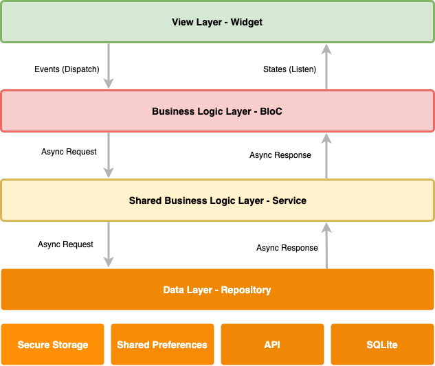

#### A Flutter package that makes it easy to implement the BLoC Design Pattern using the power of reactive streams.
##### Following the best practices for building robust mobile applications the architecture below can be used along with the BloC layer.

This package is built to work with [flutter_rx_bloc](https://github.com/Prime-Holding/FlutterRxBloc) and [rx_bloc_generator](https://github.com/Prime-Holding/RxBlocGenerator)

# Overview


# View Layer - Widgets
Flutter widgets are built using a modern framework that takes inspiration from React. The central idea is that you build your UI out of widgets. Widgets describe what their view should look like given their current configuration and state. When the BloC state changes, the widget rebuilds its description, which the framework diffs against the previous description in order to determine the minimal changes needed in the underlying render tree to transition from one state to the next.

# Business Logic Layer - BloC
The BloC is an abstraction of the view exposing a state (observables) and inputs (events). Each BloC should encapsulate the business logic in a way that makes it easy to be reused across the entire app. The following rules have to be considered when a BloC is being implemented:
1. It should never reference a view.
2. It should encapsulate specific business logic of the screen.
3. The BloC should generally not contain state, even though Stateful BloCs are acceptable in case the models/collection should be locally manipulated Example: sorting/filtering/adding/removing items from a collection etc.
4. It should be unit testable.
For better readability, custom transformers have to be implemented to serve specific Observable needs.

# Shared Business Logic Layer - Service
The service layer is responsible for handling domain specific business logic as it's shared within multiple screens or even for the entire application.The goal is to offload the BloC of a shared business logic so that we keep BloC light and at the same time we maintain good separation of concerns.

# Data Layer - Repository
The repository pattern is a design pattern that isolates data access behind interface abstractions. Connecting to the database, Cache or Web Service and manipulating data storage objects is performed through methods provided by the interface’s implementation. Each Repository contains methods that return Observables. The idea behind is that when the BloC requests data, the Repository will retrieve it from any data source and will provide it via Observables since the data is expected to be fetched asynchronously and the response will not be delivered immediately.

# Usage

```dart
import 'package:rx_bloc/rx_bloc.dart'; // All necessary imports can be added first
import 'package:rxdart/rxdart.dart';

part 'news_bloc.rxb.g.dart'; // Refer to the auto-generated boilerplate code

abstract class NewsBlocEvents {
  /// Fetch news
  void fetch();
}

abstract class NewsBlocStates {
  /// Presentable news
  Stream<List<News>> get news;

  /// Loading state caused by any registered result stream
  @RxBlocIgnoreState()
  Stream<bool> get isLoading;

  /// Presentable error messages
  @RxBlocIgnoreState()
  Stream<String> get errors;
}

@RxBloc()
class NewsBloc extends $NewsBloc {
  NewsRepository _newsRepository;

  /// Inject all necessary repositories, which the the block depends on.
  NewsBloc(this._newsRepository);

  /// Map event/s to the news state
  @override
  Stream<List<News>> _mapToNewsState() => _$fetchEvent //auto generated subject
      .switchMap((_) => _newsRepository.fetch().asResultStream()) // fetch news
      .setResultStateHandler(this) // register the result stream to loading/exception
      .whereSuccess() // get only success state
      .mapToNews(); // perform some business logic on NewsModel

  /// Presentable error messages
  @override
  Stream<String> get errors =>
      errorState.map((exception) => exception.message);

  /// Loading state caused by any registered result stream
  @override
  Stream<bool> get isLoading => loadingState;
}

extension _ExceptionMessage on Exception {
  /// Extracted message from the exception
  String get message => this.toString();
}

extension _Mapper on Stream<List<NewsModel>> {
  /// Apply some business logic on NewsModel and convert it to News.
  Stream<List<News>> mapToNews() =>
      map((newsList) => newsList.map((news) => News()));
}
```
