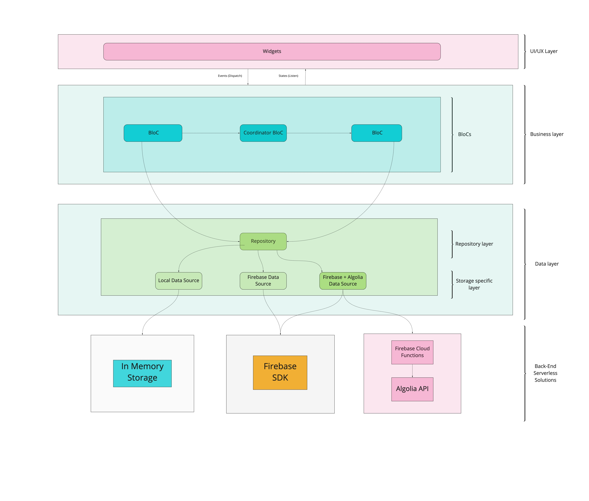

# booking_app

Flutter booking application.

## Getting Started

This project is a starting point for a Flutter application.

A few resources to get you started if this is your first Flutter project:

- [Lab: Write your first Flutter app](https://flutter.dev/docs/get-started/codelab)
- [Cookbook: Useful Flutter samples](https://flutter.dev/docs/cookbook)

For help getting started with Flutter, view our
[online documentation](https://flutter.dev/docs), which offers tutorials,
samples, guidance on mobile development, and a full API reference.

## Purpose of the project 
The main purpose of the project is to showcase the possible solutions when it comes to using Backend-as-a-Service(BaaS) products.
Installation 
Checkout and download these two projects: 
 - https://github.com/Prime-Holding/rx_bloc/tree/feature/firebase
 - https://github.com/Prime-Holding/firebase-cloud-functions

For the firebase cloud functions project, go inside the functions folder, 
execute [npm run build] and then [firebase emulators:start --only functions]  to start the local emulators of the functions.

You can also take a look at the documentation for creating cloud functions presented here: 
https://firebase.google.com/docs/functions/get-started

## Most popular solutions on the market 
 - Firebase 
 - Elasticsearch
 - Algolia
 - Amplify

## The implementation
Firebase is the most feature rich service on the market by far, that’s why we’ve decided to use their service as our primary data storage solution. Firebase has also one of the best geolocation services on the market which is very beneficial for mobile applications.

During the process of development we’ve stumbled on some serious limitations from their side including: 
  - Can't apply more than one comparison operator (<, <=, >, >=) on more than one field.
  - There's no LIKE operator
  - Paginated result does not contain total results counter
  - There's no count query
  - whereIn operator value is limited to array of 10 elements

Because of these limitations we decided to use additional service in order to bypass the already discovered flaws. 

Elasticsearch and Algolia provide very similar services to Firebase. Because of the pricing policy of Elasticsearch we decided to use Algolia on top of our Firebase solution.

Algolia also comes with its pros and cons. 
The main cons are:
 - Limited or almost non-existent community 
 - Does not have flutter implementation(you have to use it inside firebase cloud functions)
 - Sorting is still unclear and nonfunctional 
 
Due to the different advantages and disadvantages of each service we’ve come up with a decision 
to make the app work with both Firebase and Firebase Cloud Functions + Algolia in order for any client to be aware of what both services can and cannot provide.

## The result 
The final app works with three types of data sources: 
 - Local data source - the data is generated internally using the local memory. 
 - Firebase data source - the data is migrated into the Firestore Cloud, paginated according to the documentation. The user could face different errors while testing out the app - applying 2 filters, using the search bar & etc. All that because of the above described Firebase API limitations.
 - Firebase + Algolia data source - the data is migrated into the Firestore Cloud and the Algolia Storage API using the Firebase Cloud Functions. Using the cloud functions we were able to bypass some of the Firebase’s limitations. Sorting still does now work. I’ve created an issue ticket in their community board but due to lack of community members there is still no progress on this.

Take a look at our diagram called for further explanation of our data source services.
</img>
