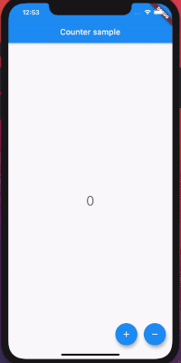

# RX Counter Example

The very known Flutter **'Counter'** example but this time using the power of reactive programming.

## Handled states

 * **Handling error state** 
    - As soon as users reach the min/max possible count they will be presented with an informative snack bar.
 * **Handling loading state**
    - While the API request is executing the action buttons will be disabled and a loading indicator will appear so that the user will know that something is happening
 * **Handling success state**
    - The count will be updated only if the API returns a success response as the widget responsible for showing the counter will not be rebuilt in case of loading or error, but just the success state.

## Articles
Follow up the 3 part article guide that explains how we achieve this step by step
- [Introducing rx_bloc ecosystem: Part 1](https://medium.com/@georgi.stanev/3cc5f4fff14e)
- [Introducing rx_bloc: Part 2](https://medium.com/@georgi.stanev/faf956f2bd99)
- [Introducing flutter_rx_bloc: Part 3](https://medium.com/@georgi.stanev/69d9114da473)

## Used packages
- [rx_bloc](https://pub.dev/packages/rx_bloc) 
- [flutter_rx_bloc](https://pub.dev/packages/flutter_rx_bloc).
- [rx_bloc_test](https://pub.dev/packages/rx_bloc_test)
- [rx_bloc_generator](https://pub.dev/packages/rx_bloc_generator)
