# Application Specification
This is a user application specification of the reminders sample app.

## User Interface

### Login Screen

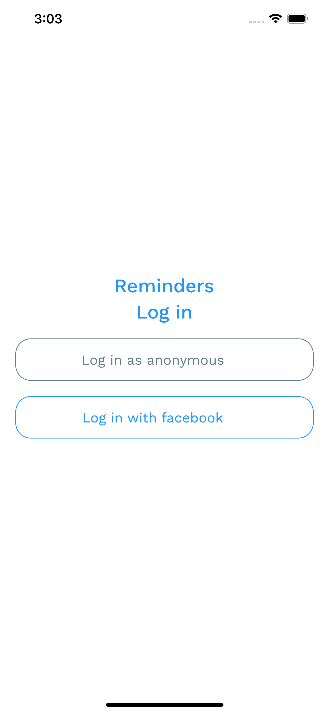

  - Shows two buttons. The first one to login as anonymous user and the second one to login with a facebook account.
  - User can tap on one of the buttons.
  - Tapping on the "Log in as anonymous" button loads the data for an anonymous user, without a user id.
  - Tapping on the "Log in with facebook" starts the facebook login process.
  - After a users taps on either of the buttons a circular loading indicator is displayed, while the next page is loading.

### Navigation Screen

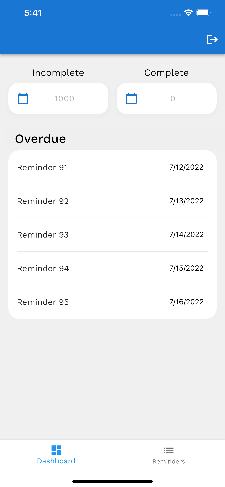

  - The app bar has one log out button.
  - The bottom navigation contains two tabs: the Dashboard list and the Reminders list.  

### Dashboard Screen

  - User can see a counter of the incomplete reminders and a counter for the complete reminders.
  - Bellow the counters the user sees an "Overdue" list of only incomplete reminders.
  - When the page is loaded for the first time the length of the fetched list is up to 5 reminders, sorted by due date in descending order. The start date is 10 days subtracted from today and the end date is today.

### Reminder Edit Options

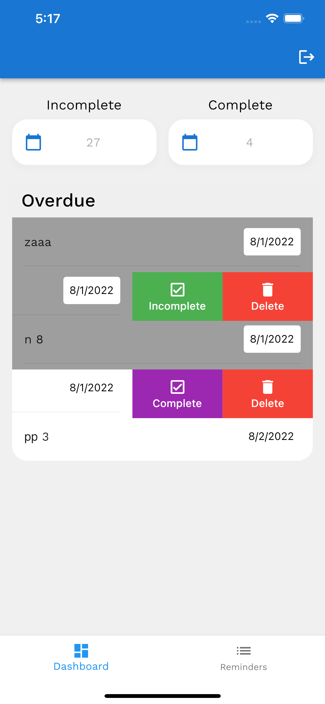

  - User can slide the reminder tile and see three options: Complete, Edit, Delete.
  - User can tap on the Edit button, but this functionality is not implemented and nothing happens.

### Reminder Completed

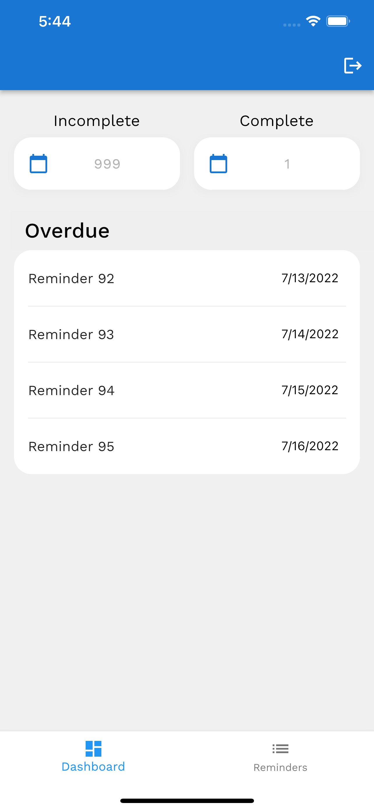

  - User can tap on the Complete button. When this happens, the reminder is removed from the Dashboard list page and moved to the Reminders list page. The reminder is marked as completed. The complete counter is increased by 1 and the incomplete counter is decreased by one.

### Reminder Deleted

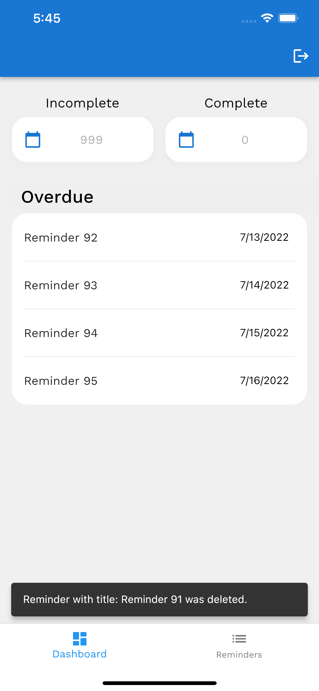

  - User can tap on the Delete button. When this happens, the reminder is deleted from the list and from the data source. The incomplete counter is decreased by one. A SnackBar is displayed with the name of the Reminder.

### Reminder Renamed

  - User can tap on the reminder name and directly start rewriting its name.

### Reminder Change Date

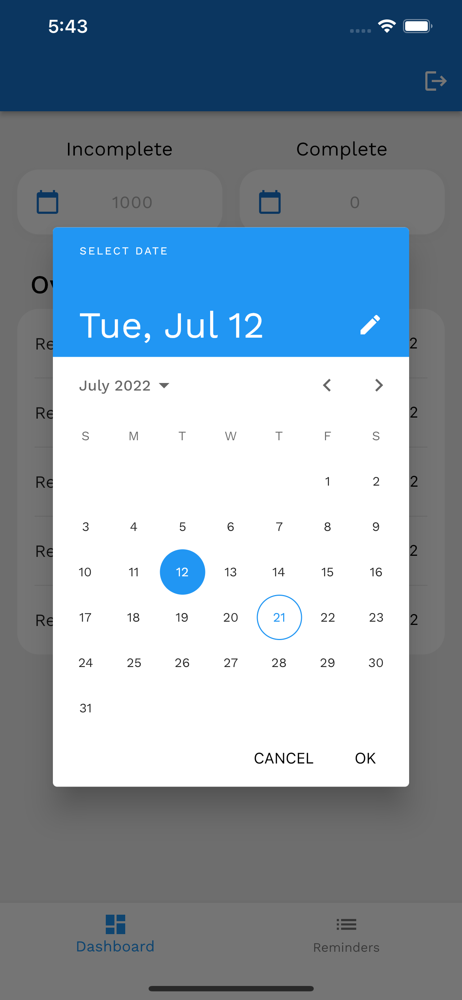

  - User can tap on the date of the reminder. When this happens, a date picker is displayed.
  - User can tap on a date after today. When this happens, the reminder is removed from the dashboard list and displayed in the Reminders list page.
  - User can tap on a date, which is 10 days before today. When this happens, the reminder is removed from the dashboard list and displayed in the Reminders list page.

### Reminder List Screen Today

  - When the page is loaded for the first time, a circular loading indicator is displayed in the middle of the screen.
  - When the page is loaded for the first time, the first 10 reminders in the reminders list are fetched. There is pagination on the list with a size of 10 of each page. The list is filtered by due date descending.

### Pull To Refresh Reminder List Page

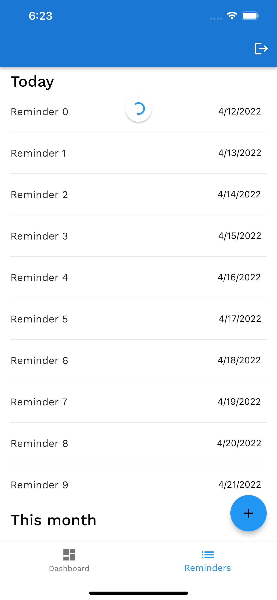

  - When the user pulls the list down, the first page of the list is reloaded on the screen.

### Reminder List Screen This month

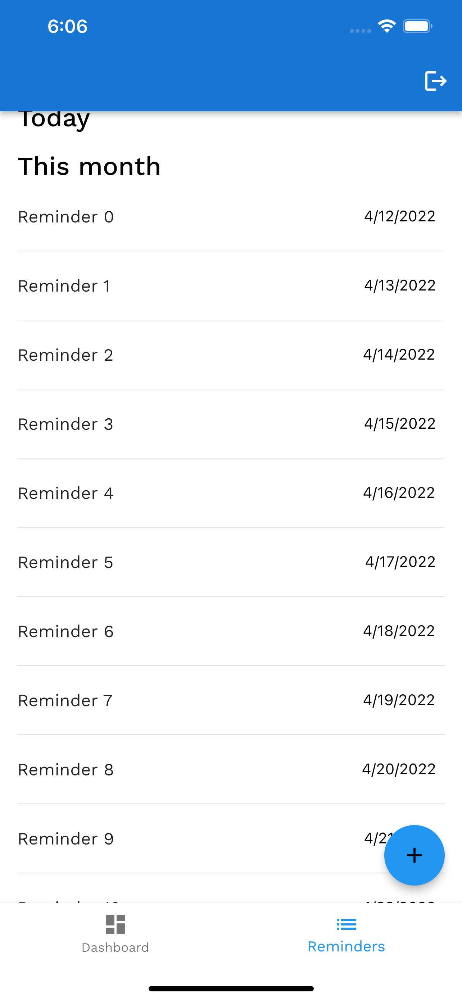

  - When the Reminders list page is loaded a list called: "This month" is loaded, where 14 elements are fetched starting from the first date of the reminders list.

### Reminder List Today Next Page

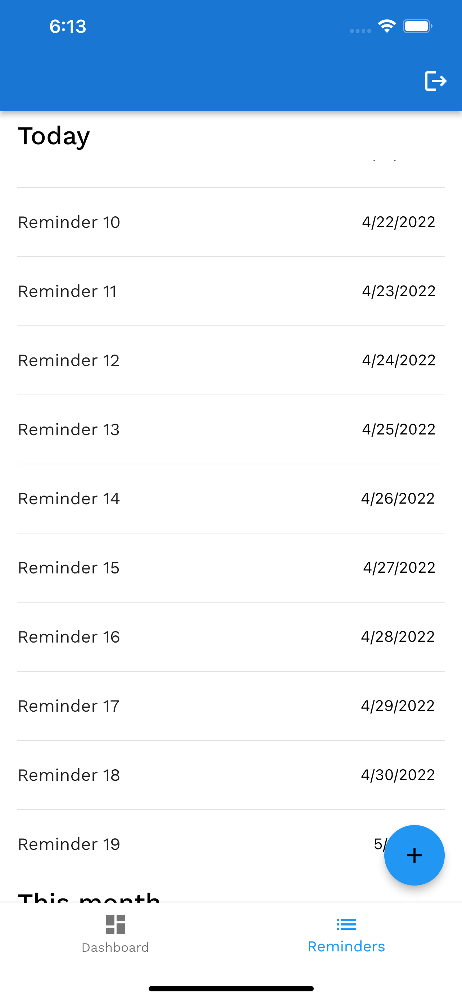

  - When the user scrolls to the bottom the Reminder list page, the next page of reminders is loaded bellow the previous page of reminder in the Reminder's "Today" list.

### Reminder Incomplete

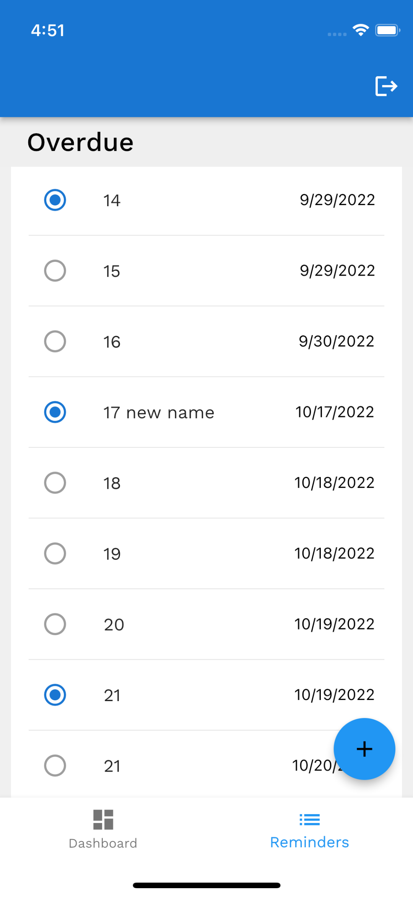
  - When a user slides a reminder after it has been marked as complete, the text in the button is changed to "Incomplete".
  - When the user selects the "Incomplete" button, the reminder is marked as incomplete. On the dashboard page, the "Incomplete" counter is increased by one and the "Complete" counter is decreased by one.

### Add Reminder 

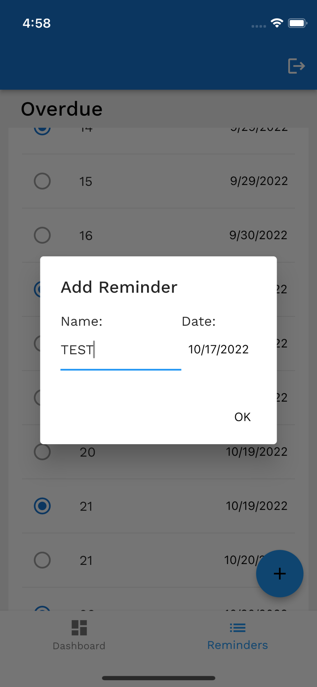

  - User can tap on the "+" button. When doing this, a new dialog window is displayed, where the user can enter the name of the newly created reminder and select the date. The default date is preselected to today.

